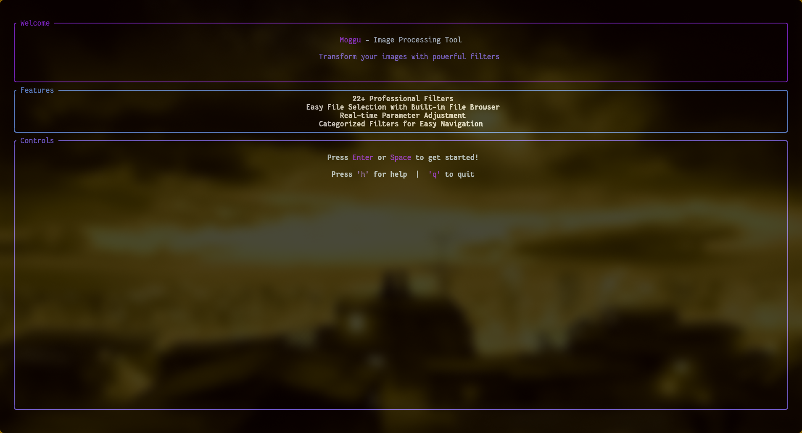
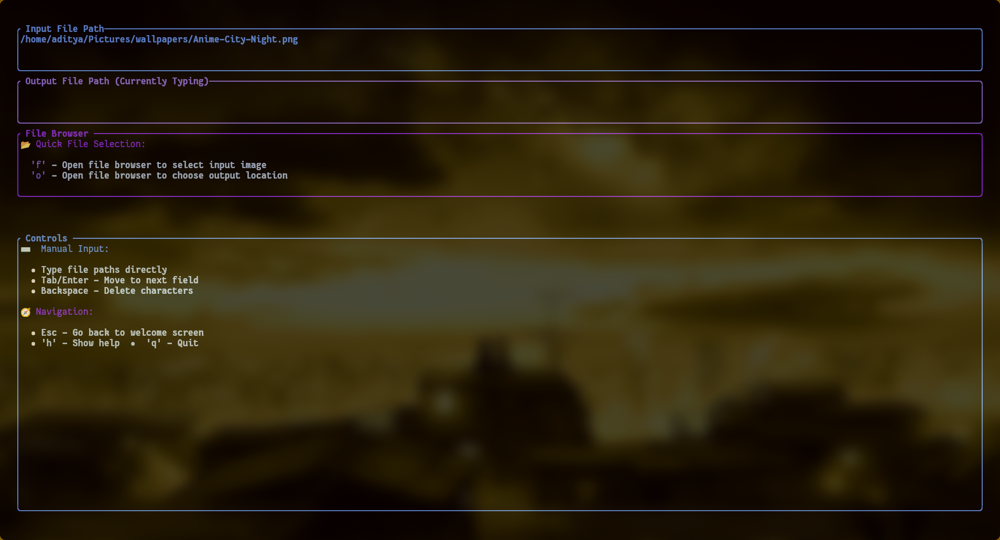
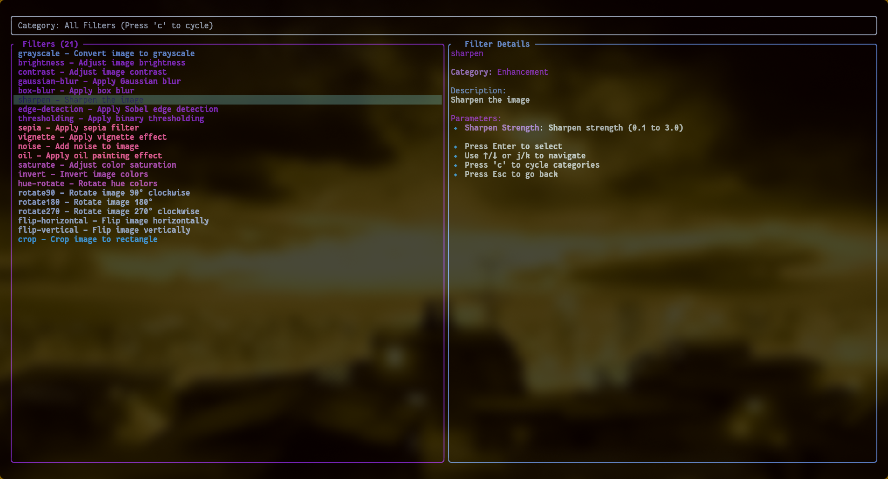
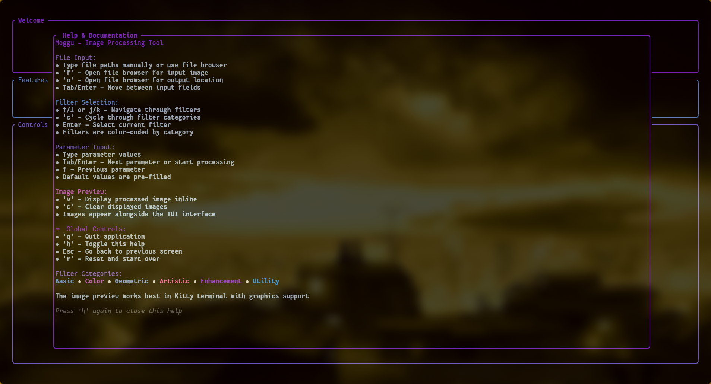
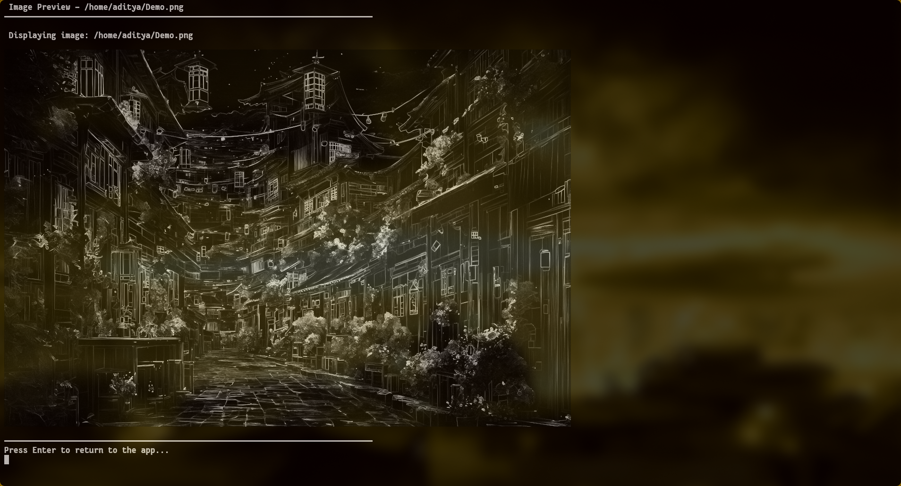
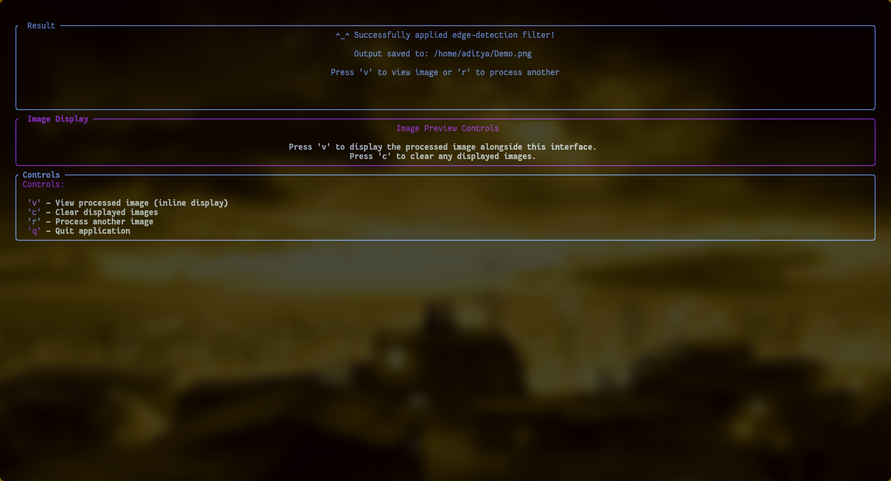

# 🎨 Moggu - Ultra-Fast Image Processing Tool

A lightning-fast, terminal-based image processing application built in Rust that delivers professional-grade filters in under 200ms, even for large images.


## 📺 Demo

<video src="https://Aditya-1304.github.io/moggu/assets/demo_real_readme.mp4" controls autoplay loop muted width="900"></video>

## 📸 Screenshots & Gallery

<details>
<summary>Click to expand TUI screenshots</summary>

### Main / Home
[](assets/screenshots/Home.png)

### File & Filter Selection
| File selection | Filter selection |
|---:|:---|
| [](assets/screenshots/file-selection.png) | [](assets/screenshots/filter-selection.png) |

### Parameter / Help / Preview / Result
| Help | Preview | Result |
|---:|:---:|:---:|
| [](assets/screenshots/help.png) | [](assets/screenshots/preview.png) | [](assets/screenshots/result.png) |

</details>

## ⚡ Key Features

### 🚀 **Blazing Fast Performance**
- **Sub-200ms processing** for most operations, even on heavy files (10MB+)
- Multi-threaded processing with optimized algorithms
- Memory-efficient operations using Rust's zero-cost abstractions
- Real-time progress tracking

### 🎯 **21+ Professional Filters**
- **Basic Filters**: Grayscale conversion
- **Color Manipulation**: Brightness, contrast, saturation, hue rotation, inversion, sepia
- **Blur & Sharpening**: Gaussian blur, box blur, sharpen, edge detection
- **Artistic Effects**: Oil painting, vignette, noise, thresholding
- **Geometric Operations**: Rotation (90°/180°/270°), horizontal/vertical flip, crop

### 💻 **Intuitive Terminal UI**
- Beautiful, responsive interface with color-coded categories
- Built-in file browser with async file dialogs
- Smart parameter validation with range checking
- Interactive help system with keyboard shortcuts
- Category filtering for easy navigation

### 🖼️ **Advanced Image Preview**
- **Inline image display** directly in terminal
- Support for `chafa` and `viu` rendering engines
- Preview processed images without leaving the application
- Terminal-friendly image viewing

## 🛠️ Installation

### From crates.io (Recommended)
```bash
cargo install moggu
```

### From Source
```bash
git clone https://github.com/yourusername/moggu
cd moggu
cargo install --path .
```

### Prerequisites
```bash
# Install Rust
curl --proto '=https' --tlsv1.2 -sSf https://sh.rustup.rs | sh
source $HOME/.cargo/env
```

#### Image Preview Dependencies (Recommended)

**For the best image preview experience, install `chafa`:**

##### Linux
```bash
# Arch Linux / Manjaro
sudo pacman -S chafa

# Ubuntu / Debian
sudo apt update && sudo apt install chafa

# Fedora / RHEL / CentOS
sudo dnf install chafa
# or for older versions:
sudo yum install chafa

# openSUSE
sudo zypper install chafa

# Alpine Linux
sudo apk add chafa

# Gentoo
sudo emerge media-gfx/chafa

# NixOS
nix-env -iA nixpkgs.chafa
# or add to configuration.nix:
# environment.systemPackages = [ pkgs.chafa ];
```

##### macOS
```bash
# Homebrew (recommended)
brew install chafa

# MacPorts
sudo port install chafa

# Nix (if using Nix on macOS)
nix-env -iA nixpkgs.chafa
```

##### Windows
```bash
# Windows Subsystem for Linux (WSL) - Ubuntu
sudo apt update && sudo apt install chafa

# Chocolatey (if available)
choco install chafa

# Scoop (if available)
scoop install chafa

# MSYS2
pacman -S mingw-w64-x86_64-chafa

# Manual Installation:
# 1. Download from: https://github.com/hpjansson/chafa/releases
# 2. Extract to a directory in your PATH
# 3. Or use Windows Terminal with WSL for best experience
```

**Alternative: Cross-platform Rust-based image viewer**
```bash
# If chafa is not available, install viu (pure Rust)
cargo install viu

# Or sixel-image (for terminals with sixel support)
cargo install sixel-image
```

**Terminal Compatibility Check:**
```bash
# Test if your terminal supports chafa
echo "Testing chafa..." && chafa --version

# Test image display (replace with any image file)
chafa your-image.jpg

# Test viu if installed
viu your-image.jpg
```

**Note:** For Windows users, we highly recommend using **Windows Terminal** with WSL2 for the best experience, as native Windows terminals have limited image display capabilities.

## 🎮 Usage

### Quick Start
1. **Launch**: `cargo run`
2. **Select Files**: Use built-in browser (`f` for input, `o` for output) or type paths
3. **Choose Filter**: Navigate with `↑/↓` or `j/k`, cycle categories with `c`
4. **Set Parameters**: Enter values or use defaults
5. **Process**: Automatic processing with real-time progress
6. **Preview**: Press `v` to view results inline

### Keyboard Controls

#### Global
- `q` - Quit application
- `h` - Toggle help
- `Esc` - Go back
- `r` - Reset to start

#### File Input
- `f` - Open file browser (input)
- `o` - Open file browser (output)
- `Tab`/`Enter` - Next field

#### Filter Selection
- `↑/↓` or `j/k` - Navigate filters
- `c` - Cycle categories
- `Enter` - Select filter

#### Parameter Input
- `Tab`/`Enter` - Next parameter
- `↑` - Previous parameter
- `Backspace` - Delete

#### Results
- `v` - View processed image
- `c` - Clear displayed images
- `r` - Process another image

## 🎨 Filter Categories

### 🔵 Basic (1 filter)
- **Grayscale**: Convert to grayscale

### 🟣 Color (4 filters)  
- **Saturate**: Adjust color saturation (0.0-3.0)
- **Invert**: Invert all colors
- **Hue Rotate**: Shift hue spectrum (-360° to 360°)
- **Sepia**: Apply warm sepia tone

### 🟦 Enhancement (7 filters)
- **Brightness**: Adjust luminosity (-100 to 100)
- **Contrast**: Modify contrast (0.1-3.0)
- **Gaussian Blur**: Smooth blur (0.1-20.0 sigma)
- **Box Blur**: Fast blur (1-50 radius)
- **Sharpen**: Enhance details (0.1-3.0)
- **Edge Detection**: Sobel edge detection
- **Thresholding**: Binary threshold (0-255)

### 🟪 Artistic (4 filters)
- **Vignette**: Dark edge effect (0.1-1.0)
- **Noise**: Add random noise (1-100)
- **Oil Painting**: Artistic oil effect (radius 1-10, levels 5-50)

### 🟨 Geometric (6 filters)
- **Rotate**: 90°, 180°, 270° rotation
- **Flip**: Horizontal/vertical mirroring
- **Crop**: Custom rectangle cropping

### 🟩 Utility (1 filter)
- Advanced cropping with position control

## 🔧 Technical Details

### Architecture
- **Language**: Rust 2024 Edition
- **UI Framework**: Ratatui with Crossterm
- **Image Processing**: Custom algorithms + image crate
- **Async Runtime**: Tokio for file operations
- **Concurrency**: Multi-threaded processing

### Optimization Features
- **SIMD Instructions**: Vectorized operations
- **Memory Pooling**: Reduced allocations
- **Lazy Loading**: On-demand processing
- **Pipeline Architecture**: Streaming transforms
- **Zero-Copy Operations**: Direct memory access

### Supported Formats
- **Input**: PNG, JPEG, BMP, TIFF, GIF
- **Output**: PNG, JPEG, BMP, TIFF

## 🖥️ Terminal Compatibility

### Recommended Terminals
- **Kitty** (Best image preview support)
- **iTerm2** (macOS)
- **Alacritty**
- **GNOME Terminal**
- **Windows Terminal**

### Image Preview Support
- **chafa** (Recommended) - Rich color display
- **viu** - Fast Unicode display
- **Fallback** - File path display

## 🤝 Contributing

1. Fork the repository
2. Create feature branch: `git checkout -b feature-name`
3. Commit changes: `git commit -am 'Add feature'`
4. Push branch: `git push origin feature-name`
5. Submit pull request

## 📝 License

MIT License - see [LICENSE](LICENSE) for details.

---

**⚡ Built for speed. Designed for productivity. Perfect for